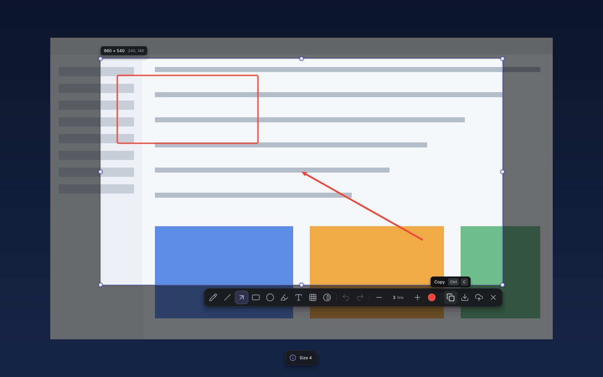
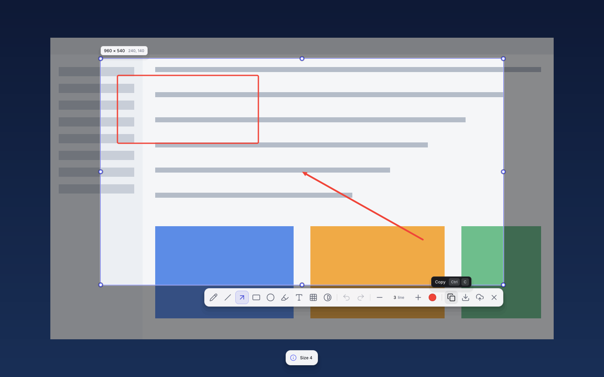
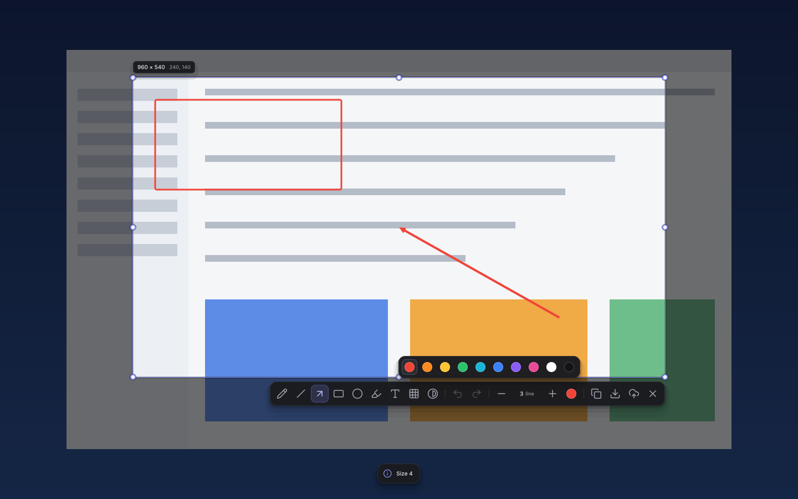
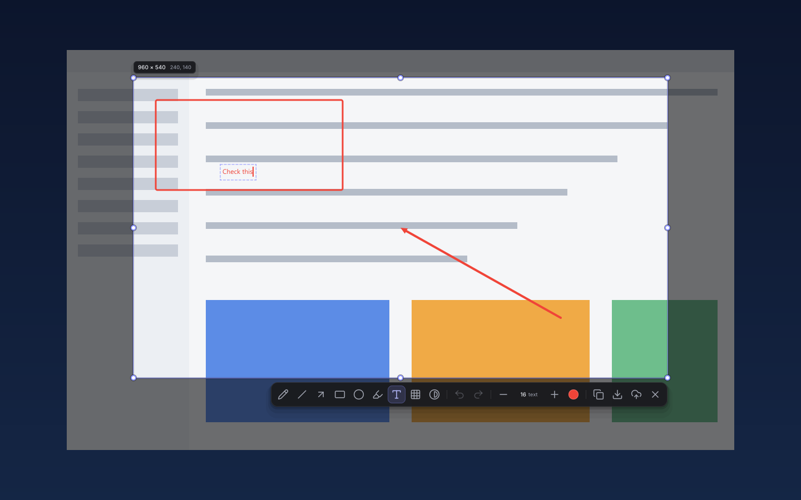

# Rustshot

A fast, tiny screenshot and annotation tool for **Windows, macOS and Linux**,
modelled on [Flameshot](https://flameshot.org) and written in Rust.

Press a hotkey, drag a region, annotate it, and copy, save or upload it.
The whole app is a single ~550 KB native binary with no runtime and no GUI
toolkit: every pixel of the overlay is drawn by Rustshot's own anti-aliased
renderer.



| Light theme | Color palette | Text tool |
|---|---|---|
|  |  |  |

## Features

- **Region capture** with resize handles, arrow-key nudging, and a live
  `W × H` size readout. A single click selects the whole screen.
- **Annotation tools:** pencil, line, arrow, rectangle, ellipse, highlighter,
  text, pixelate and invert, with Shift constraints (squares, circles, 45°
  lines) and unlimited undo/redo.
- **Export:** copy to the clipboard, save as PNG, JPEG or BMP straight into
  a dated folder (or through the native save dialog), or upload to imgur
  with the link copied for you.
- **Settings window** for the theme, hotkeys, saving and every editor
  shortcut (no need to edit `config.toml` by hand).
- **Modern overlay UI:** dark and light themes that follow your OS, a grouped
  toolbar that wraps and repositions near screen edges, tooltips with the real
  shortcuts, and short animations.
- **Multi-monitor aware:** spans all monitors when they share a scale factor;
  the toolbar and notices stay on the monitor you're working on.
- **Global hotkey daemon** (default <kbd>Meta</kbd>+<kbd>Shift</kbd>+<kbd>X</kbd>).
- **Scriptable CLI** for headless captures (`rustshot full --clip`,
  `--region`, `--raw` to stdout, `--upload`, delays).
- **In-app updates** for direct downloads: download, verify and restart
  from one dialog (store installs update themselves).

## Install

Download the latest build from
**[GitHub Releases](https://github.com/nappsllc/rustshot/releases/latest)**:

| Platform | File | Notes |
|---|---|---|
| Windows 10/11 | `rustshot-<v>-setup.exe` | Per-user installer, no admin needed; optional desktop shortcut and start-with-Windows. |
| Windows (portable) | `rustshot-<v>-windows-x86_64.exe` | Single executable. |
| macOS 11+ | `rustshot-<v>-macos-universal.dmg` | Universal (Apple Silicon + Intel). Drag to Applications. |
| Debian / Ubuntu | `rustshot-<v>-amd64.deb` | `sudo apt install ./rustshot-<v>-amd64.deb` |
| Any Linux | `rustshot-<v>-x86_64.AppImage` | `chmod +x` and run. |
| Any Linux | `rustshot.flatpak` | `flatpak install --user rustshot.flatpak` |
| Any Linux | `rustshot_<v>_amd64.snap` | `sudo snap install --dangerous rustshot_<v>_amd64.snap` |
| Any Linux | `rustshot-<v>-linux-x86_64.tar.gz` | Binary + desktop file; see `INSTALL.txt` inside. |

Store and package-manager listings (Microsoft Store, winget, Mac App Store,
Homebrew, Flathub, Snap Store, AUR) are being set up; see
[docs/STORES.md](docs/STORES.md).

> **Unsigned builds.** Current releases are not code-signed yet. Windows
> SmartScreen may warn on first run (More info › Run anyway); on macOS,
> right-click the app › Open the first time.

## Usage

Start the background daemon once (the installers can do this at login):

```bash
rustshot          # or `rustshot daemon`
```

Launching Rustshot again while it is running triggers a capture in the running
instance instead of starting a second one.

Then press <kbd>Shift</kbd>+<kbd>Meta</kbd>+<kbd>X</kbd> (Meta is <kbd>Win</kbd> on
Windows, <kbd>Super</kbd> on Linux, <kbd>⌘</kbd> on macOS) to capture. Quit the daemon with
<kbd>Ctrl</kbd>+<kbd>Alt</kbd>+<kbd>Shift</kbd>+<kbd>Q</kbd>.

Or capture directly from a terminal:

```bash
rustshot                          # start the background daemon with tray icon (default)
rustshot gui                      # interactive capture
rustshot gui --clip               # select, annotate, Enter copies to clipboard
rustshot full --path ~/Pictures   # whole desktop, no editor
rustshot screen -n 1 --edit       # second monitor, open the editor
rustshot gui --region 800x600+100+100 --upload
rustshot full --raw > shot.png    # PNG bytes to stdout
rustshot update                   # check for a newer release
rustshot settings                 # open the Settings window
rustshot --help
```

### Settings

Open **Settings…** from the tray menu, or run `rustshot settings` (a running
daemon opens its window; otherwise the window opens on its own). Three tabs:

- **General:** theme (Auto follows the OS), the overlay renderer (Windows),
  start at login (hidden for store installs), the daily update check, and
  the global capture and quit hotkeys (click a box, then press the keys;
  <kbd>Backspace</kbd> clears it). *Open config file* opens `config.toml`.
- **Saving:** see [Saving](#saving).
- **Shortcuts:** every editor shortcut (see below).

**OK** saves and closes, **Apply** saves and keeps the window open,
**Cancel** (or <kbd>Esc</kbd>) discards. The running daemon picks the new
settings up at once: the next capture uses them and the hotkeys are
re-registered; a hotkey another app already uses is reported (in the
window, or as a tray notification) and the previous one is kept. Saving
rewrites `config.toml`: if the file has comments or keys Rustshot does not
know, the first save asks before removing them. A `config.toml` with an
error is never overwritten silently: the window shows the error and offers
*Open config file* or *Reset to defaults…* (after a second question; the
old file is kept as `config.toml.bak`).

On Linux, *Browse…* needs `zenity` or `kdialog`, and pasting into the text
fields needs `wl-paste` (Wayland), `xclip` or `xsel`.
On macOS the window is not available yet; Settings opens `config.toml`
in your editor instead.

### Saving

<kbd>Ctrl</kbd>+<kbd>S</kbd> (and <kbd>Enter</kbd> when no other task was
asked for) saves without a dialog to

    <folder>/<subfolder pattern>/<file name pattern>.<png|jpg|bmp>

By default that is `Pictures/rustshot/2026-10-10/2026-10-10_14-30.png`: one
folder per day. A name that is taken gets `_1`, `_2`, ...; the toast shows
the full path. <kbd>Ctrl</kbd>+<kbd>Shift</kbd>+<kbd>S</kbd> always asks
(Save As, seeded with that folder and name; the format follows the
extension you pick), and *Ask where to save* makes
<kbd>Ctrl</kbd>+<kbd>S</kbd> ask too. The clipboard and uploads stay PNG.

In Settings › Saving: the folder (with **Browse…**), daily subfolders and
their pattern, the format (JPEG has a quality slider, 1-100, default 90),
and the file name. The token buttons insert at the caret of the last
pattern field you used; the line under the field shows where the next
capture would go. **Restore** brings back `%F_%H-%M`, **Clear** empties it.

| Token | Meaning | Token | Meaning |
|---|---|---|---|
| `%C` | century (00-99) | `%M` | minute (00-59) |
| `%j` | day of year (001-366) | `%m` | month (01-12) |
| `%d` | day (01-31) | `%S` | second (00-59) |
| `%e` | day of month (1-31) | `%V` | ISO week (01-53) |
| `%F` | `%Y-%m-%d` | `%u` | weekday (1 = Monday ... 7) |
| `%H` | hour (00-23) | `%y` | year (00-99) |
| `%I` | hour (01-12) | `%Y` | year (2026) |
| `%T` / `%R` | `%H:%M:%S` / `%H:%M` | `%p`, `%s` | AM/PM, Unix time |

Characters Windows does not allow in names (`<>:"/\|?*`) become `-`; in the
subfolder pattern `/` nests folders (`%Y/%m`) and `..` is dropped.

### Editor shortcuts

| Action | Keys |
|---|---|
| Pencil / Line / Arrow | <kbd>P</kbd> / <kbd>D</kbd> / <kbd>A</kbd> |
| Rectangle / Ellipse / Marker | <kbd>R</kbd> / <kbd>C</kbd> / <kbd>M</kbd> |
| Text / Pixelate / Invert | <kbd>T</kbd> / <kbd>B</kbd> / <kbd>I</kbd> |
| Stroke size | mouse wheel, or the − / + buttons |
| Undo / Redo | <kbd>Ctrl</kbd>+<kbd>Z</kbd> / <kbd>Ctrl</kbd>+<kbd>Shift</kbd>+<kbd>Z</kbd> (or <kbd>Ctrl</kbd>+<kbd>Y</kbd>) |
| Copy / Save / Upload | <kbd>Ctrl</kbd>+<kbd>C</kbd> / <kbd>Ctrl</kbd>+<kbd>S</kbd> / <kbd>Ctrl</kbd>+<kbd>U</kbd> |
| Save As (always asks) | <kbd>Ctrl</kbd>+<kbd>Shift</kbd>+<kbd>S</kbd> |
| Select the whole screen | <kbd>Ctrl</kbd>+<kbd>A</kbd> |
| Toggle the color palette | <kbd>Space</kbd> |
| Accept (save, or run the `--clip`/`--path` tasks) | <kbd>Enter</kbd> |
| Drop the current tool / cancel | <kbd>Esc</kbd> |
| Move / resize the selection | arrow keys / <kbd>Shift</kbd>+arrows |
| Square, circle, 45° line | hold <kbd>Shift</kbd> while drawing |
| Keep aspect ratio while resizing | hold <kbd>Ctrl</kbd> |

On macOS, <kbd>⌘</kbd> works wherever <kbd>Ctrl</kbd> is listed.

The keys above (except arrows, the mouse wheel and hold-while-drawing
modifiers) can be remapped in Settings › Shortcuts: select an action, press
its new keys (<kbd>Backspace</kbd> unbinds it), and **Reset all** goes back
to the defaults. Rebinding sets a single chord; an action with two (Redo's
<kbd>Ctrl</kbd>+<kbd>Y</kbd>) gets its second one back with **Reset all**, or
list several in `config.toml`. Keys bound to two actions are shown in red with a note;
the first action in the list wins. In `config.toml` the same lives in a
`[shortcuts]` table at the end (one or more chords separated by commas,
`""` unbinds; `rustshot config --check` reports unknown actions and chords
bound twice):

```toml
[shortcuts]
tool_pencil = "P"         # tool_line, tool_arrow, tool_rectangle, tool_circle,
                          # tool_marker, tool_text, tool_pixelate, tool_invert
save_as = "Ctrl+Shift+S"  # copy, save, upload, undo, select_all, toggle_palette,
redo = "Ctrl+Shift+Z, Ctrl+Y"  # accept (Enter), cancel (Esc)
```

## Configuration

Rustshot reads an optional `config.toml`:

| OS | Path |
|---|---|
| Windows | `%APPDATA%\rustshot\config.toml` |
| macOS / Linux | `$XDG_CONFIG_HOME/rustshot/config.toml` or `~/.config/rustshot/config.toml` |

`rustshot config` prints the path; `rustshot config --check` validates the
file. Every key is optional:

```toml
save_path = ""                    # default save folder ("" = Pictures/rustshot)
save_subfolder = true             # one subfolder per day inside save_path
subfolder_pattern = "%F"          # its name (same tokens; "/" nests, e.g. "%Y/%m")
filename_pattern = "%F_%H-%M"     # strftime-style
save_format = "png"               # "png", "jpg" or "bmp" (clipboard and upload stay PNG)
jpeg_quality = 90                 # 1-100
save_dialog = false               # true = Ctrl+S always asks where to save
theme = "auto"                    # "auto" (follow the OS), "dark" or "light"
ui_color = ""                     # accent override, e.g. "#8b93ff" ("" = theme accent)
contrast_opacity = 148            # dim strength outside the selection (0-255)
draw_color = "#f04438"
draw_thickness = 3.0
draw_marker_size = 15.0
draw_pixelate_size = 12.0
draw_font_size = 16.0
undo_limit = 100
user_colors = ["#f04438", "#ff8a1f", "#ffc532", "#2dc06f", "#19b5d6",
               "#3b82f6", "#8b5cf6", "#ec4899", "#ffffff", "#111318"]
capture_hotkey = "Shift+Meta+X"
quit_hotkey = "Ctrl+Alt+Shift+Q"
copy_url_after_upload = true
capture_active_monitor = false    # true = only the monitor under the cursor
check_updates = true              # daemon checks GitHub once a day
skip_version = ""                 # a version the daily check ignores ("Skip this version")
renderer = "gdi"                  # Windows overlay: "gdi" (low memory) or "software"; ignored elsewhere
upload_client_id = "313baf0c7b4d3ff"
```

## Updates

The daemon checks GitHub for a new release once a day (turn it off in
Settings › General or with `check_updates = false`); the tray's *Check for
updates* checks now. A new version opens a dialog with the release notes:
**Update** downloads it, checks its SHA-256 against the release's
`SHA256SUMS` (it refuses to install on a mismatch or a missing entry),
waits for an open capture to close and restarts into the new version;
**Skip this version** silences the daily check for that version (a manual
check still offers it). Downloads come only from the project's GitHub
releases. This protects against corrupted or swapped downloads, not
against a compromised GitHub account. Store, Flathub, Snap and package
installs are updated by their store; `.deb` installs open the release page.

## Platform notes

- **Linux** needs an **X11** session (or XWayland). Native Wayland capture and
  hotkeys are not supported yet. Runtime dependencies: `libx11`, `libxrandr`.
- **Mixed-DPI setups** (for example a 150 % laptop with a 100 % monitor): the
  editor captures the monitor under the cursor instead of spanning all of them.
- **macOS** asks for *Screen Recording* permission on first capture
  (System Settings › Privacy & Security).

## Building from source

Requires Rust 1.87+ (edition 2024). On Linux also install the X11 headers
(`libx11-dev libxrandr-dev` on Debian/Ubuntu).

```bash
cargo build --release          # target/release/rustshot(.exe)
cargo test                     # unit tests
cargo test -- --ignored        # live display / clipboard / network tests
```

Packaging scripts live in [`packaging/`](packaging) (NSIS, MSIX, `.app`/dmg,
deb, AppImage, Flatpak, Snap, AUR, Homebrew). CI builds all of them on every
push; pushing a `vX.Y.Z` tag that matches `Cargo.toml` publishes a GitHub
Release ([`.github/workflows/release.yml`](.github/workflows/release.yml)).

Design references: [docs/design/rustshot-ui](docs/design/rustshot-ui) (UI
boards) and [docs/superpowers](docs/superpowers) (specs and plans).

## Privacy

No telemetry. Images leave your machine only when you choose **Upload**. The
daemon's update check is a single anonymous request to the GitHub Releases
API, at most once a day, and can be turned off with `check_updates = false`.
See [PRIVACY.md](PRIVACY.md).

## License

Rustshot is free software under the **GNU General Public License v3.0 only**
([LICENSE](LICENSE)). Its behaviour and UI are modelled on Flameshot (also
GPL-3.0). It bundles the Inter font (SIL OFL 1.1) and Lucide icons (ISC); see
[THIRD_PARTY_NOTICES.md](THIRD_PARTY_NOTICES.md).
