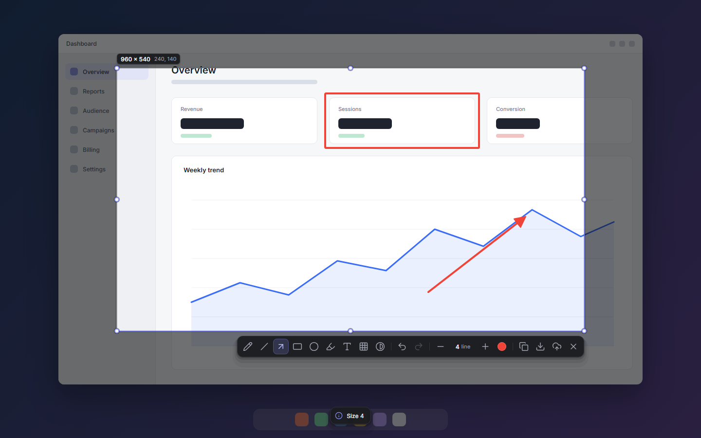
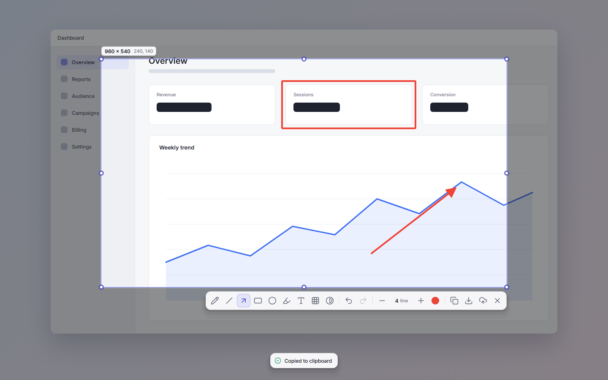
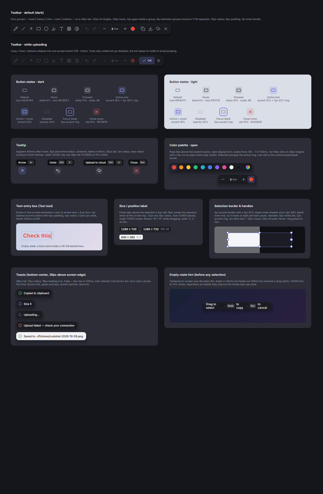
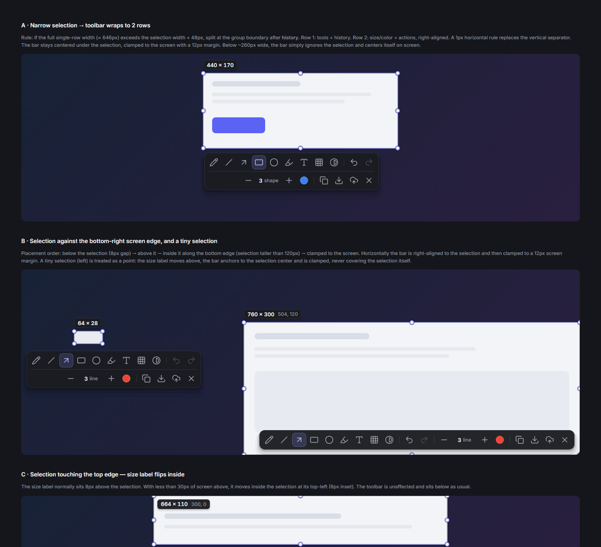
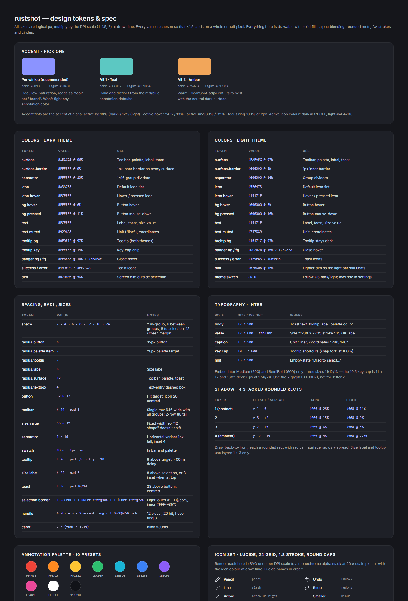

# rustshot UI — design boards

Snapshot of the Claude Design canvas "rustshot UI"
(https://claude.ai/artifact/7kjFGk5t8vBpHrtJ2xhVCH), the source of
`docs/superpowers/specs/2026-10-09-modern-ui-design.md`.

| Board | Source | Render |
|---|---|---|
| 01 · Overlay (dark) | [Main.dc.html](Main.dc.html) |  |
| 02 · Overlay (light) | [Light.dc.html](Light.dc.html) |  |
| 03 · Close-ups | [Closeups.dc.html](Closeups.dc.html) |  |
| 04 · Wrapped & edge placement | [Variants.dc.html](Variants.dc.html) |  |
| 05 · Spec sheet & tokens | [Spec.dc.html](Spec.dc.html) |  |

`canvas.json` is the canvas index (board sizes and order). The `.dc.html`
files open in any browser without the canvas runtime; the PNGs were rendered
from them with headless Chrome at the board sizes in `canvas.json`:

```bash
chrome --headless=new --hide-scrollbars --window-size=1440,900 --screenshot=Main.png Main.dc.html
```

Where the shipped UI intentionally differs from the boards (real shortcuts,
"Enter to save", tools stay enabled while busy, Medium-only font), see
"Decisions that refine the spec" in
`docs/superpowers/plans/2026-10-09-modern-ui.md`.
